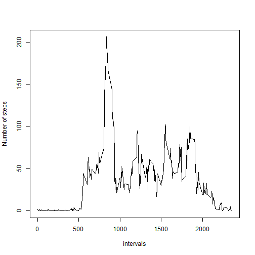
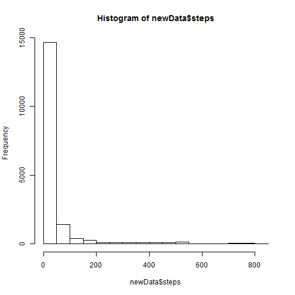

# Reproducible Research: Peer Assessment 1

## Loading and preprocessing the data
reading the csv file inside the zip

```r
data <- read.csv(unz("activity.zip", "activity.csv"))
head(data)
```

```
##   steps       date interval
## 1    NA 2012-10-01        0
## 2    NA 2012-10-01        5
## 3    NA 2012-10-01       10
## 4    NA 2012-10-01       15
## 5    NA 2012-10-01       20
## 6    NA 2012-10-01       25
```


## What is mean total number of steps taken per day?

histogram of the total number of steps taken each day

```r
hist(data$steps)
```

 

mean and median total number of steps taken per day

```r
mean(data$steps, na.rm=T)
```

```
## [1] 37.38
```

```r
median(data$steps, na.rm=T)
```

```
## [1] 0
```

## What is the average daily activity pattern?
### time series plot

```r
subset <- split(data, data$interval)
avg <- sapply(subset, function (x) {mean(x$steps, na.rm=T)})
plot(names(avg), avg, type="l", xlab="intervals",
     ylab="Number of steps")
```

 

### 5-minute interval with maximum number of steps on average across all the days in the dataset

```r
maxint <- which(avg == max(avg))
maxint
```

```
## 835 
## 104
```

as we can see the 5-minute interval with the maximum number of steps is **835** which is at the 104 position in the avg vector

## Imputing missing values

number of missing values in the dataset

```r
colSums(is.na(data))
```

```
##    steps     date interval 
##     2304        0        0
```

### filling in all of the missing values in the **NEW dataset (newData)**.
the empty values on the steps variable are replaced with the average of the steps for each interval across all days

```r
newData <- data

logicVector <- is.na(newData$steps)
newData$steps[logicVector] = avg[as.character(newData$interval[logicVector])]
```

**NEW dataset (newData)** histogram of the total number of steps taken each day 

```r
hist(newData$steps)
```

 

as we can see the histograms looks very similar, the only major difference seems to be the an increase on the yaxis values

**NEW dataset (newData)** mean and median total number of steps taken per day

```r
mean(newData$steps, na.rm=T)
```

```
## [1] 37.38
```

```r
median(newData$steps, na.rm=T)
```

```
## [1] 0
```

## Are there differences in activity patterns between weekdays and weekends?

factor variable in the dataset with two levels – “weekday” and “weekend”

```r
newData$wday <- weekdays(as.Date(newData$date))
newData$wdayFactor <- factor(ifelse(newData$wday %in% c("Saturday", "Sunday"),"weekend", "weekday"))

library(lattice)
library(plyr)

sumData <- ddply(newData, .(interval, wdayFactor), summarize, mean = mean(steps))
xyplot(mean ~ interval | wdayFactor, data=sumData, layout=c(1,2), type="l", ylab="Number of steps")
```

 
